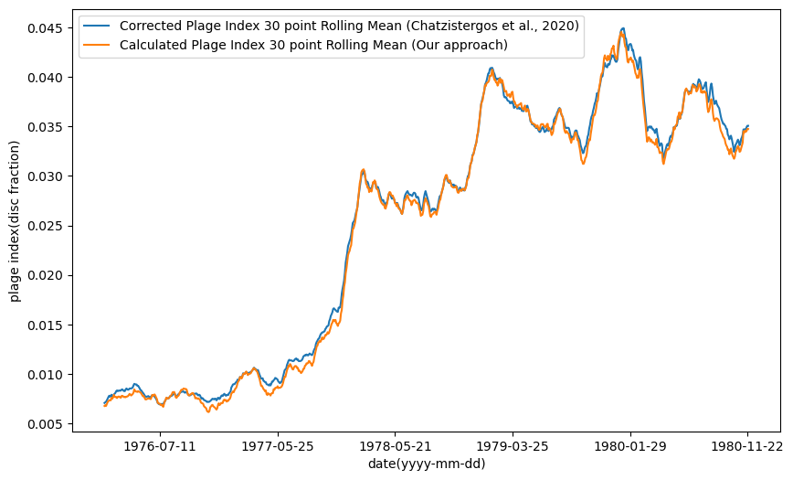

# Plages-Identification

Solar Plages are bright chromospheric features observed in Ca II K photographic observations of the sun. These are regions of high magnetic field concentration, and thus, trace the magnetic activity of the Sun and are one of the most important features to study long term variability of the Sun as Ca II K spectroheliograms have been recorded for more than a century. However, the detection of the plages from century-long databases is a non-trivial task which needs significant human resources when done manually. Hence, in this study we propose an image processing algorithm which can identify solar plages from Ca II K photographic observations. The proposed study has been implemented on archival data from the Kodaikanal Solar Observatory. To ensure that the algorithm works, irrespective of noise level, brightness and other image properties, we randomly draw a samples of images from data archive to test our algorithm.

# Local installation

```
conda create -n env python=3.9

git clone https://github.com/abhimanyu911/Plages-Identification.git

pip install -r requirements.txt
```


# Sample Results


## Solar Cycle 21:





[See notebook for detailed results](./demo.ipynb)


# Images

Head over to [this link](https://drive.google.com/drive/folders/1nMKew8hG8Eo6Ej1jSz7uSgyiW4C4AzGK?usp=share_link) for input and output images


# Web App Demo


Web App link : https://abhimanyu911-plages-identification-app-yfyqbq.streamlit.app/


# If you happen to use any of our code, please cite the manuscript as follows:


[Manuscript](https://academic.oup.com/rasti/article/2/1/393/7223482)


```
@article{10.1093/rasti/rzad027,
    author = {Gharat, Sarvesh and Bose, Bhaskar and Borthakur, Abhimanyu and Mazumder, Rakesh},
    title = "{An image processing approach to identify solar plages observed at 393.37 nm by the Kodaikanal solar observatory}",
    journal = {RAS Techniques and Instruments},
    volume = {2},
    number = {1},
    pages = {393-397},
    year = {2023},
    month = {07},
    abstract = "{Solar plages, which are bright regions on the Sun’s surface, are an important indicator of solar activity. In this study, we propose an automated algorithm for identifying solar plages in Ca-K wavelength solar data obtained from the Kodaikanal Solar Observatory. The algorithm successfully annotates all visually identifiable plages in an image and outputs the corresponding calculated plage index. We perform a time series analysis of the plage index (rolling mean) across multiple solar cycles to test the algorithm’s reliability and robustness. The results show a strong correlation between the calculated plage index and those reported in a previous study. The correlation coefficients obtained for all the solar cycles are higher than 0.90, indicating the reliability of the model. We also suggest that adjusting the hyperparameters appropriately for a specific image using our web-based app can increase the model’s efficiency. The algorithm has been deployed on the Streamlit Community Cloud platform, where users can upload images and customize the hyperparameters for desired results. The input data used in this study is freely available from the KSO data archive, and the code and the generated data are publicly available on our GitHub repository. Our proposed algorithm provides an efficient and reliable method for identifying solar plages, which can aid the study of solar activity and its impact on the Earth’s climate, technology, and space weather.}",
    issn = {2752-8200},
    doi = {10.1093/rasti/rzad027},
    url = {https://doi.org/10.1093/rasti/rzad027},
    eprint = {https://academic.oup.com/rasti/article-pdf/2/1/393/50930555/rzad027.pdf},
}
```