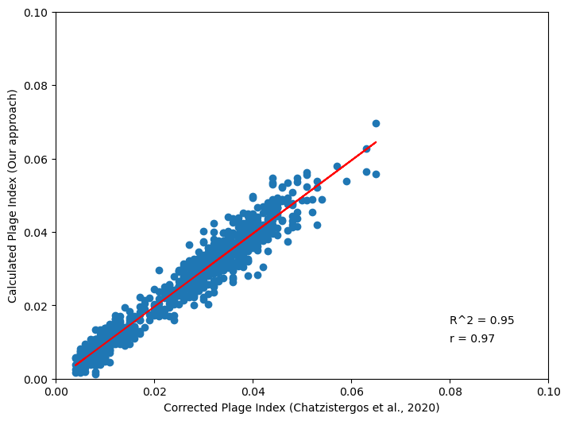

# Plages-Identification

Solar Plages are bright chromospheric features observed in Ca II K photographic observations of the sun. These are regions of high magnetic field concentration, and thus, trace the magnetic activity of the Sun and are one of the most important features to study long term variability of the Sun as Ca II K spectroheliograms have been recorded for more than a century. However, the detection of the plages from century-long databases is a non-trivial task which needs significant human resources when done manually. Hence, in this study we propose an image processing algorithm which can identify solar plages from Ca II K photographic observations. The proposed study has been implemented on archival data from the Kodaikanal Solar Observatory. To ensure that the algorithm works, irrespective of noise level, brightness and other image properties, we randomly draw a samples of images from data archive to test our algorithm.

# Sample Results

## Solar Cycle 21:

[See notebook for detailed results](./demo.ipynb)

# Images

Head over to [this link](https://drive.google.com/drive/folders/1nMKew8hG8Eo6Ej1jSz7uSgyiW4C4AzGK?usp=share_link) for input and output images

# Web App Demo

