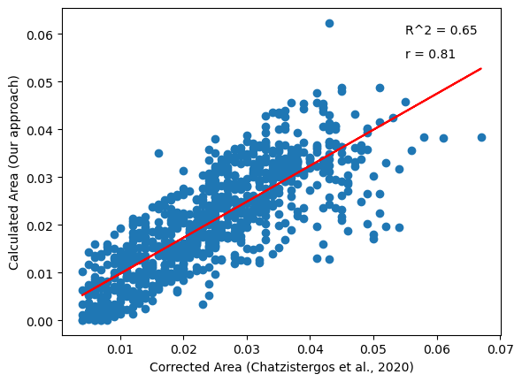
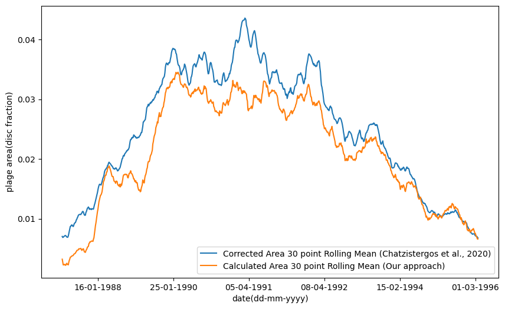

# Plages-Identification

Solar Plages are bright chromospheric features observed in Ca II K photographic observations of the sun. These are regions of high magnetic field concentration thus tracer of magnetic activity of the Sun and are one of the most important features to study long term variability of the Sun as Ca II K spectroheliograms are recorded for more than a century. . However, detection of the plages from century-long databases is a non-trivial task and need significant human resources for doing it manually. Hence, in this study we propose an image processing algorithm which can identify solar plages from Ca II K photographic observations. The proposed study has been implemented on archival data from Kodaikanal Solar Observatory. To ensure that the algorithm works, irrespective of noise level, brightness and other image properties, we randomly draw a samples of images from data archive to test our algorithm.

# Results

